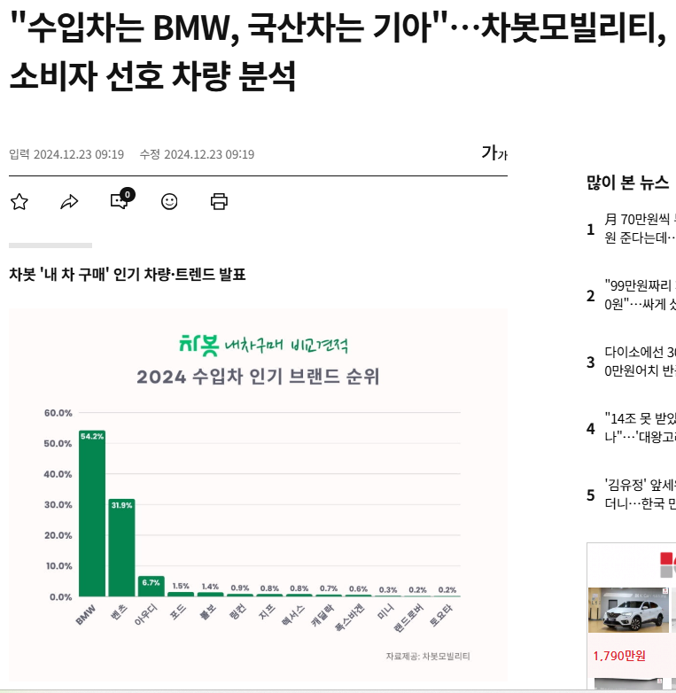
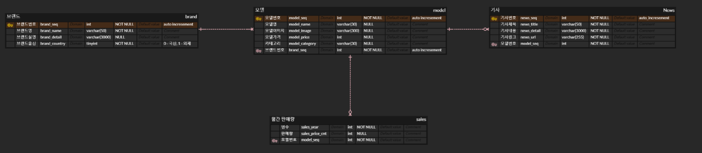

# SK 네트웍스 Family AI 캠프 11기 1차 프로젝트
 

# INTRODUCTION TEAM
## ⭐중증 CORE 센터⭐

|김상익|김장수|김형주|이  근|전유빈|
|:---:|:---:|:---:|:---:|:---:|
||||||
|[@김상익](https://github.com/GTU9)|[@김장수](https://github.com/js-kkk)|[@김형주](https://github.com/Kim-Hyeong-Ju)|[@이근](https://github.com/REROUN)|[@전유빈](https://github.com/yubnyx)|

 

# INTRODUCTION PROJECT

### 🚗프로젝트 명
#### **CATCAR**

#### 🗓️ 개발 기간
2025.02.25 ~ 2025.02.26 (총 2일)

### 🐉 프로젝트 내용

자동차 가격 분석 및 소비자 선호도 차종 분석을 통해 합리적인 소비를 도와드리기 위한 서비스 입니다.

### 🚗 프로젝트 필요성

브랜드별·차종별 선호도 및 트렌드가 빠르게 변화하면서 소비자들은 최신 정보를 바탕으로 구매 하기를 원합니다.
이에 따라, CATCAR는 각 차량의 판매실적, 타브랜드와의 비교 실적, 관련 뉴스기사 등의 정보를 제공하여 보다 효율적인 차량 구매를 돕고자 합니다.

### ✅ 프로젝트 목표

- 신차의 판매 실적 분석 및 타브랜드와의 비교 실적을 통한 합리적인 가격 범위를 제공
- 각 차량 모델의 판매 대수를 통해 현재 트렌드를 알 수 있음
- 뉴스 기사를 제공하여 사용자가 보다 신뢰할 수 있는 정보를 바탕으로 구매 결정을 내릴 수 있도록 지원

 

# ⚒️Tech Stack
## 주요 기술
> 개발 환경 및 도구

||||||
|:---:|:---:|:---:|:---:|:---:|

> UI

||
|:---:|

> 데이터 수집 및 처리

|||||
|:---:|:---:|:---:|:---:|
 

# WBS
|작업명|시작일|종료일|담당자|산출물|의존작업|
|---|---|---|---|---|---|
|프로젝트 주제 선정|02.25|02.25|ALL|없음|없음|
|Streamlit 화면 설계|02.25|02.25|ALL|WEB 화면|없음|
|ERD 작성|02.25|02.25|김상익, 이근|ERD 다이어그램|없음|
|FAQ 작성|02.25|02.25|ALL|[노션 페이지](https://www.notion.so/ohgiraffers/Core-1a4649136c118066b76bef49b54e95ff)|없음|
|Streamlit 화면 구현|02.25|02.25|전유빈|Web Page|Streamlit 화면 설계|
|데이터 크롤링|02.25|02.26|김장수, 김형주, 이근|DB 데이터|없음|
|DB 생성|02.26|02.26|김상익, 이근|없음|ERD|
|데이터-DB연동|02.26|02.26|김상익, 이근|DB 데이터|데이터 크롤링|
|Streamlit-DB연동|02.26|02.26|김상익, 이근, 전유빈|Web Page|Streamlit 화면 구현, DB|
|코드 취합|02.26|02.26|ALL|Web Page, DB 데이터|데이터 크롤링, Streamlit 화면 구현|
|최종 점검|02.26|02.26|ALL|Web Page|없음|

 

# 요구사항 명세서
|No.|대상|분류|기능명|기능 설명|
|---|---|---|---|---|
|REQ-HOME-001|사용자|메인|소개|프로젝트 명과 취지, 설명 출력|
|REQ-HOME-002|사용자|메인|차량 판매 실적 그래프|임의의 대표 브랜드의 차량 판매 실적 그래프|
| - | - | - | - | - |
|REQ-DOM-001|사용자|국내차|선택 차량 모델 실적, 정보 그래프|브랜드와 모델을 설정, 검색을 통해 해당 모델의 정보를 불러옴|
|REQ-DOM-002|사용자|국내차량|비교군 차량 모델 실적 정보 그래프|검색된 모델과 같은 카테고리를 가진 자동차를 비교군으로 3개의 모델까지 불러옴|
| - | - | - | - | - |
|REQ-FOR-001|사용자|외제차량|선택 차량 모델 실적, 정보 그래프|브랜드와 모델을 설정, 검색을 통해 해당 모델의 정보를 불러옴|
|REQ-FOR-001|사용자|외제차량|비교군 차량 모델 실적 정보 그래프|검색된 모델과 같은 카테고리를 가진 자동차를 비교군으로 3개의 모델까지 불러옴|
| - | - | - | - | - |
|REQ-FAQ-001|사용자|FAQ|FAQ와 그에 대한 답변|스크래핑한 데이터를 기반으로 쿼리를 이용해 최적의 답을 산출함|

 

# ERD

 

# 웹 크롤러 코드

 

# 수행 결과

### 소개 및 메인페이지

### 차량 검색 및 해당 모델과 같은 타입의 차종 실적 비교

### 특정 차량 모델의 월별 판매량 및 실적과 기사

### 스크랩핑된 데이터를 기반으로 적절한 FAQ 알고리즘 구현

 

# 한 줄 회고

- **김상익**
    학습을 시작한 후 처음 해본 팀 프로젝트라 매우 설렜고, 즐거운 시간이었습니다. 시간이 좀 더 있었더라면 보다 완성도를 높일 수 있었을 텐데, 그 부분이 아쉽습니다.
  
- **김장수**
    강의 시간에 배웠던 크롤링 방법을 응용해서 다나와자동차 사이트의 여러 데이터를 크롤링해보며 배웠던 내용을 익힐 수 있어 유익한 시간이었습니다. 

- **이 근**
    전체적인 모듈 통합 및 크롤링 자동화, DB 연동을 하며 매우 흥미롭고 재미난 시간이었습니다.

- **전유빈**
    스트림릿으로 만들면서 더 많은 기능을 익힐 수 있어 흥미로운 시간이었습니다.

- **김형주**
    selenium을 활용한 웹 크롤링이 처음이라 많이 걱정했지만, 팀원들의 조언과 응원에 힘입어 좋은 결과를 만들 수 있었습니다.
